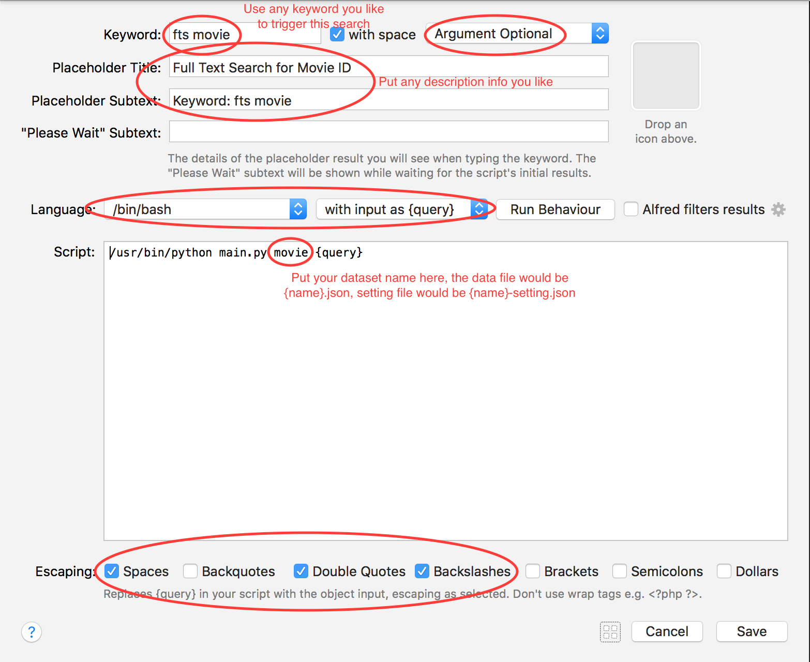
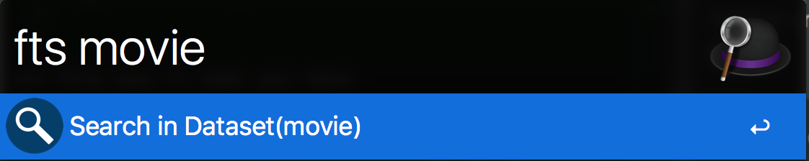
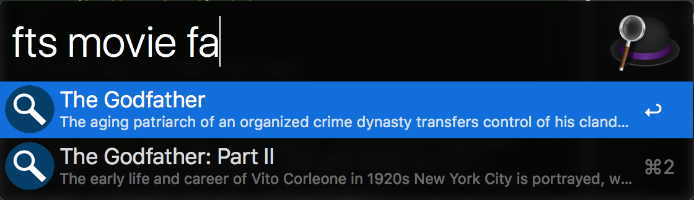

Full Text Search Anything Workflow
==============================================================================

The ``fts.anything`` workflow allows user searching their own data set with super fast full text search engine.

How to Use
------------------------------------------------------------------------------

Suppose you have a movie dataset in json format, it should contains list of documents. save your data at ``${HOME}/.alfred-fts/movie.json``:

.. code-block:: python

    [
        {
            "movie_id": 1,
            "title": "The Shawshank Redemption",
            "description": "Two imprisoned men bond over a number of years, finding solace and eventual redemption through acts of common decency.",
            "genres": "Drama"
        },
        {
            "movie_id": 2,
            "title": "The Godfather",
            "description": "The aging patriarch of an organized crime dynasty transfers control of his clandestine empire to his reluctant son.",
            "genres": "Crime,Drama"
        },
        {
            "movie_id": 3,
            "title": "The Godfather: Part II",
            "description": "The early life and career of Vito Corleone in 1920s New York City is portrayed, while his son, Michael, expands and tightens his grip on the family crime syndicate.",
            "genres": "Crime,Drama"
        }
    ]

There are three ways to index your data:

- ngram: even a few of characters could match, usually for fuzzy match, good for short text. ``fa`` matches ``The Godfather``.
- phrase: the entire word has to be match, usually for long text. e.g. ``early`` matches ``The early life and career of ...``.
- keyword: the entire keyword has to be match, usually for category and tag data. ``crime`` matches ``Crime,Drama``

Save your setting file at ``${HOME}/.alfred-fts/movie-setting.json``:

.. code-block:: python

    {
        "columns": ["movie_id", "title", "description", "genres"],
        "ngram_columns": ["title"],
        "phrase_columns": ["description"],
        "keyword_columns": ["genres"],
        "ngram_minsize": 2,
        "ngram_maxsize": 10,
        "keyword_lowercase": true,
        "keyword_commas": true,
        "title_field": "title",
        "subtitle_field": "description",
        "arg_field": "movie_id",
        "autocomplete_field": "title"
    }

- ``columns`` specified the fields you want to include in your dataset.
- ``ngram_minsize`` is the minimal length of the token you can use to match , default is 2. This line is not nesnecessary.
- ``ngram_maxsize`` is the maximum length of the token you can use to match , default is 2. This line is not nesnecessary.
- ``keyword_lowercase``, if ``true``, then it is NOT case-sensitive.
- ``keyword_commas``, is the separator for keyword column comma? or space?

And:

- ``title_field``, specify the column you want to use as Alfred Item title.
- ``subtitle_field``, specify the column you want to use as Alfred Item subtitle.
- ``arg_field``, specify the column you want to use as Alfred Item argument.
- ``autocomplete_field``, specify the column you want to use as Alfred Item auto complete (Tab key).

These four setting also support stirng format template, for example, ``subtitle_field`` can be: ``movie_id={movie_id}, description={description}``. This template can automatically retrieve data from the document.

Then create a ``script filter`` widget (Or just duplicate from the demo one), set your own keyword to trigger a new search. And tell the script filter which data set you want to search.

In this example, I use ``fts movie`` to trigger the search.

At the first time your started a search, the index is automatically built. The index file is at ``${HOME}/.alfred-fts/{dataset_name}-whoosh_index``.

If you want to **update the dataset**, you can manually remove the index directory, it will automatically rebuilt when you search it.
